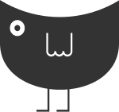

# Corvus

Corvus is a webapp we made for Hack@Brown 2020 that speeds up the pace of social change in America through nontraditional means. Through our discussion and game process of encouraging open-mindedness, we hope to challenge our users’ beliefs and allow them to understand the other POV on some of the country’s most divisive issues.

## 

### Our tech stack breakdown:
* We used React.JS to write the frontend, under `clients/`.
* We wrote our backend API in Express.JS, under this top level directory.
* We used Google Firebase authentication and the firestore NoSQL database to store our users.

### To run Corvus:
1. `npm install` in this directory and `clients/`
2. `npm start` in this directory

### Additional designs: 
https://www.figma.com/file/GfWBxVRymiiCaiStr8n1KJ/hack-brown?node-id=0%3A1

### Contributors: 
Edwin Carbajal, Ashley Hong, Brandon Liang, Anthony Mu
